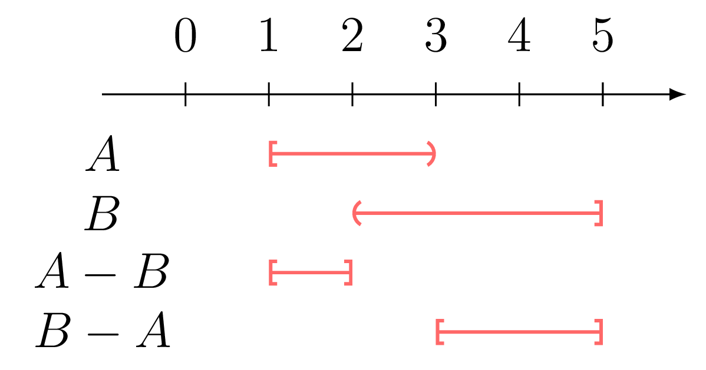
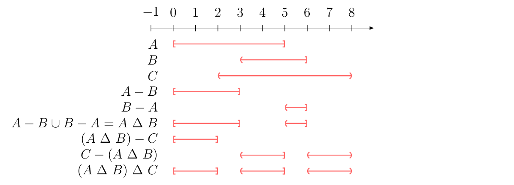

+++
title  = "Problems 1-23"
layout = "solution-single"
+++

1 $-3 < 2$

2 $4 > -6$

3 $\frac{\pi}{3} > 1$

4 $\sqrt{2} < \frac{1}{4}$

5 $\sqrt{8} < 3.1$

6 $-10 < -3\pi$

7

...

8 If $A$ is the set of positive
integers, $B$ negative integers and $C$ multiples of $3$, then
**(a)** $A \cup B$ is the set of all integers excluding $0$.
**(b)** $A \cup B \cup C$ is the set of all integers including $0$,
because $3 \cdot 0$ is an element of $C$, **(c)** $B \cap C$ is the
set of all negative multiples of $3$, i.e. $\{ 3n: n$ is an integer
$< 0 \}$, **(d)** $A \cap B$ is an empty set, because the
intersection of these sets does not contain any elements, and
**(e)** $\overline{C}$ $=$ $\mathbb{Z} \setminus \overline{C}$,
that is the set of all integers not multiple of $3$. For example,
sample around the integer $0$ is $\{$ $\cdots$, $-7$, $-5$,$-4$,
$-2$, $-1$, $1$, $2$, $4$, $5$, $7$, $\cdots$ $\}$.

9 If $A$ is the set of multiples if
$2$, $B$ the set of multiple of $3$ and the set $C$ the set of
multiples of $5$, then **(a)** $A$ $\cup$ $C$ is the set of
multiples of $2$, multiples of $5$ or both, such as $2$ and $10$,
**(b)** $B$ $\cap$ $C$ is the set of numbers that are multiples of
both $3$ and $5$ at the same time, like $15$ or $30$, etc., **(c)**
$A$ $\cup$ $B$ $\cup$ $C$ is the set of numbers that are multiples
of $2$, $3$, $5$ or a multiple of any possible multiplication
combination of these numbers, such as $2 \cdot 3$ $=$ $6$, or $6
\cdot 5$ $=$ $30$.

10 If $A$ $=$ $(-\infty, 5)$ and $B$
$=$ $[-1,10]$, then $A \cup B$ is the set $(\infty, 10]$, and $A
\cap B$ are all of the real values in the range $[-1,5)$.

11 The relation $\overline{A \cap B}$
means that arbitrary $x$ is not in the intersection of these two
sets, or in other words, $x$ is not in $A$ or $x$ is not in $B$, so
$x$ must be in the complement of $A$ or $B$, that is $x$ is in
$\overline{A}$ $\cup$ $\overline{B}$. Because of this $\overline{A
\cap B}$ $=$ $\overline{A}$ $\cup$ $\overline{B}$.

12 If arbitrary $x$ is not in $A$ or
not in $B$ then it is in the complement of $A$ and $B$, but on the
other hand, if arbitrary $x$ is not complement of $A$ and not in
the complement of $B$, then $x$ must be in the complement of $A$
and $B$, which is the same set, so $\overline{A \cup B}$ $=$
$\overline{A}$ $\cap$ $\overline{B}$.

13 **(a)** The range $(1,1000)$ is
bounded below by $1$ and above by $1000$, so the range is bounded.
**(b)** The range $[-10^{37},19^{37}]$ is also bounded above and
below, by $-10^{37}$ and $10^{37}$, respectively, so it's a bounded
range. **(c)** The range $[4, \infty]$ is bounded below by $4$, but
not bounded above because positive $-\infty$ does not have a
boundary, so this set is not bounded. **(d)** Same goes for the set
$(-\infty,6)$ &mdash; The set is not bounded below because of the
negative infinity, but is bounded above by $6$. **(e)** The set of
positive odd integers is bounded below by $1$, but it's not bounded
above. **(f)** The set of negative rationals larger than $-20$ is
bounded bounded below by $-20$ and above by a negative rational
less than $0$, so this set is bounded.

14 If $A$ $=$ $[1,3]$ and $B$ $=$
$[2,4]$, then **(a)** $A$ $-$ $B$ $=$ $[1,2)$ and **(b)** $B$ $-$
$A$ $=$ $(3,4]$.

15 For the sets defined in 8: **(a)** $A - B$ $=$ $A$, **(b)** $B - A$ $=$
$B$, **(c)** $A - C$ $=$ $\{$ The set of positive integers not
multiple of $3$ $\}$ and **(d)** $C - B$ $=$ $\{$ The set of
positive multiples of $3$ $\}$.

16 For the sets defined in 9: **(a)** $A - C$ $=$ $\{$ The set of number
multiple of $2$, but not multiple of $5$ $\}$, **(b)** $B - A$ $=$
$\{$ The set of number multiple of $3$, but not multiple of $2$ and
**(c)** $B - C$ $=$ $\{$ The set of number multiple of $3$, but not
multiple of $3$ $\}$.

17 For the intervals of 10: **(a)** $A - B$ $=$ $(-\infty, -1)$ and **(b)**
$B - A$ $=$ $(5,10]$.

18 When $A$ $=$ $(-\infty,-5)$ $\cup$
$(5,\infty)$ and $B$ $=$ $[-10,3)$, **(a)** $A$ $-$ $(A - B)$ $=$
$A$ $-$ $((\infty,-10)$ $\cup$ $(5,\infty))$ $=$ $(\infty,-10)$
$\cup$ $(5,\infty)$. On the other hand, **(b)** $A$ $-$ $(B - A)$
$=$ $A$ $-$ $[-5,3))$ $=$ $A$.

19 If $A$ $\Delta$ $B$ $=$ $(A - B)$
$\cup$ $(B - A)$ and $A$ $=$ $[1,3)$ and $B$ $=$ $(2,5]$, then $A$
$\Delta$ $B$ $=$ $([1,2]) \cup ([3,5])$. This is shown in the
Figure 1.

    

        
         
        <caption>Figure 1</caption>
    

    

        
         
        <caption>Figure 1</caption>
    

20 When $A$ $=$ $[0,5]$, $B$ $=$
$(3,6]$, and $C$ $=$ $(2,8)$, **(a)** $(A \ \Delta \ B) \ \Delta C$
$=$ $[0,2]$ $\cup$ $(3,5]$ $\cup$ $(6,8)$. This is illustrated in
Figure 2:

    

        
         
        <caption>Figure 2</caption>
    

    

        [The figure can be viewed only in horizontal mode]
    

        <caption>Figure 2</caption>

**(b)** The operation $A \ \Delta \ (B \ \Delta \ C)$ leads to
same solution as $(A \ \Delta \ B) \ \Delta \ C$, that is  $A \
\Delta \ (B \ \Delta \ C)$ $=$ $[0,2]$ $\cup$ $(3,5]$ $\cup$
$(6,8)$ $=$ $(A \ \Delta \ B) \ \Delta \ C$.

21 **(a)** When $x$ is in $(A \cup
B)$, by definition of the set union, $x$ is in $A$ or $x$ is in
$B$. If $A$ and $B$ are not disjoint, $x$ can also be in $(A \cap
B)$. If the latter set is removed from the former, $x$ can only be
either in $A$ or $B$, but never in the intersection of $A$ and $B$,
because it's removed, so therefore $x$ is in $(A \cup B)$ $-$ $(A
\cap B)$.

On the other hand, if $B$ is removed from $A$ and vice versa, $x$
is then either in the first reduced set or it is in the second
reduced set, but $x$ can not be in their intersection. When
considering the union of these sets, the $x$ is in $(A - B)$ $\cup$
$(B - A)$.

In any case, these sets equal each other, so by definition of
symmetric difference, $A \ \Delta \ B$ $=$ $(A - B)$ $\cup$ $(B -
A)$, which is also equal to $(A \cup B)$ $-$ $(A \cap B)$.

**(b)** See **(a)** and **(b)** of 20.

22 When $A$ and $B$ are completely
overlapping each other, $A \cup B$ $=$ $A \cap B$, and when the
sets are disjoint $A \cup B$ $=$ $\varnothing$ $=$ $A \cap B$.

23 **(a)** Relation $\varnothing$ $=$
$0$, if false because $\varnothing$ is an empty set, that is,
$\varnothing$ $=$ $\{\}$, but on the other hand $0$, is something,
that is, it's a set denoting nothing, but it is not an empty set,
so $\varnothing$ $=$ $\{\}$ $\neq$ $0$. **(b)** The relation
$\varnothing$ $=$ $\{\varnothing\}$, is also false. The left
hand-side of the relation is an empty set, while the right
hand-side is a set containing empty set. **(c)** The relation
$\varnothing$ $\in$ $\{\varnothing\}$ is true, because empty set,
that is, the set $\varnothing$ indeed is a set of
$\{\varnothing\}$. **(d)** The relation $\varnothing$ $\subseteq$
$\{\varnothing\}$ is also true, because $\varnothing$ is a subset
of the set $\{\varnothing\}$. **(e)** The relation $\varnothing$
$\in$ $\varnothing$ is false, because empty set does not contain
anything, or in other words, empty set is a set holding no
elements, so $\varnothing$ can not be in $\varnothing$, that is,
empty set can not be an element of a (another) empty set. **(f)**
The relation $\varnothing$ $\subseteq$ $\varnothing$ is true,
because empty set is an element of any set, by definition.
