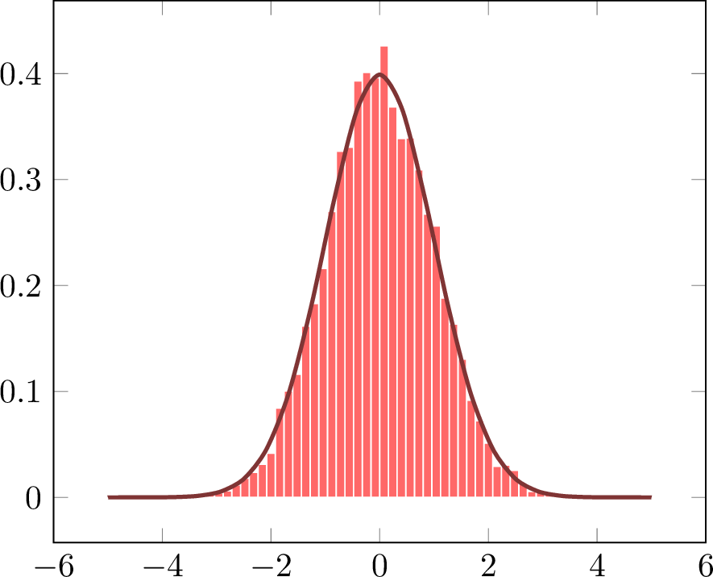

+++
title = 'Generating random numbers in C++'
date = 2024-11-10T14:03:15+02:00
+++

As is described in Forsyth (2018), the definition of **normal
distribution**, which is a distribution that describes a
distribution of a random variable ($x$), given a [mean][1] ($\mu$)
and [variance][2] ($\sigma$) as

<div class = "widescreen">
$$
    \phantom{,} \
    f(x \ | \ \mu, \ \sigma)
    = \dfrac{1}{\sqrt{2 \pi \sigma^2}} \exp \left( - \dfrac{(\mu - x)^2}{2 \sigma^2} \right)
    \ . \tag{1}
$$
</div>

<div class = "smallscreen">
$$
    \begin{array}{c c c}
        \phantom{=} & f(x \ | \ \mu, \ \sigma) & \phantom{=}
        \\[1em] = & \dfrac{1}{\sqrt{2 \pi \sigma^2}} \exp \left( - \dfrac{(\mu - x)^2}{2 \sigma^2} \right) & \phantom{=}
    \end{array}
    \tag{1}
$$
</div>

When $\mu = 0$ and $\sigma = 1$, $(1)$ can be written

<div class = "widescreen">
$$
    \phantom{.} \
        f(x \ | \ 0, 1)
            = \dfrac{1}{\sqrt{2 \pi (1)^2}} \exp \left( - \dfrac{(0 - x)^2}{2 (1)^2} \right)
            = \dfrac{1}{\sqrt{2 \pi}} \exp \left( \dfrac{1}{2} x^2 \right) \ .
    \tag{2}
$$
</div>

<div class = "smallscreen">
$$
    \begin{array}{ c c c }
        \phantom{=} & f(x \ | \ 0, 1) &
            \\[1em] = & \dfrac{1}{\sqrt{2 \pi (1)^2}} \exp \left( - \dfrac{(0 - x)^2}{2 (1)^2} \right) &
            \\[1em] = & \dfrac{1}{\sqrt{2 \pi}} \exp \left( \dfrac{1}{2} x^2 \right) \ . &
    \end{array}
    \tag{2}
$$
</div>

Equation $(2)$ can be expressed in C++ by initializing the
[`std::normal_distribution`][6] class, defined in the `<random>`
header, by writing

```c++
std::normal_distribution nrml_dist {0.0, 1.0};
```

Now, drawing values from the `nrml_dist` is done with the use of a
[**Mersenne twister**][3] [pseudo-random number][4] generator (PRNG)
object [`std::mt19987`][5] initialized with C++'s random number
generator [`std::random_device`][6] by writing

```c++
// Initialize a PRNG
std::mt19937 prng {
    std::random_device {} ()
    //                 ↑  ↑
    //                 │  │
    //                 └ Construct a temporary object ..
    //                    └ .. and call the object immediately
};
```

and then passing the `prng` to the `nrml_dist` as an argument, i.e.

```c++
nrml_dist(prng);
```

This results in a pseudo-random number such as `-0.142727`.

To generate, say $10 \ 000$, pseudo-random numbers, one can write,

```c++
for (int i = 0; i < 10'000; i++) {
    std::cout << std::fixed << nrml_dist(prng) << '\n';
}
```
pipeline the output of the program that runs this [`std::cout`][8]
to a [CSV-file][9] as a single tall column, and draw the histogram
of output.

Example histogram based on a such CSV-file is illustrated in the
next figure,

<div align = "center">
    
    <br>
    <caption>Example histogram of data output from <code>nrml_dist</code></caption>
</div>

from where it can be seen that when the data generated by the
`nrml_dist` is binned into 50 bins, the distribution of these $10 \
000$ values are aking to the form of normal distribution's graph.
This is a visual indication that the values drawn from the
`nrml_dist` are indeed distributed normally.

### References

Forsyth, D. (2018). Probability and statistics for computer science. Springer.

<!-- Hyperlinks -->
[1]: https://www.mathsisfun.com/mean.html
[2]: https://www.mathsisfun.com/data/standard-deviation.html
[3]: https://en.wikipedia.org/wiki/Mersenne_Twister
[4]: https://www.computerhope.com/jargon/p/pseudo-random.htm
[5]: https://en.cppreference.com/w/cpp/numeric/random/mersenne_twister_engine
[6]: https://en.cppreference.com/w/cpp/numeric/random/random_device
[7]: https://en.cppreference.com/w/cpp/numeric/random/nrml_distribution
[8]: https://en.cppreference.com/w/cpp/io/cout
[9]: https://en.wikipedia.org/wiki/Comma-separated_values
