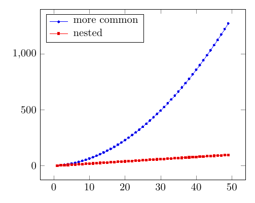

+++
title = "Nested multiplication"
date  = 2024-12-25T10:30:10+02:00
+++

How many multiplication and addition operations are needed in order to
evaluate a polynomial like

$$
    P(x) = a_0 + a_5x^5 + a_{10}x^{10} + a_{15}x^{15}
$$

and how to reduce the number of these operations?

<!--more-->

For some, finding the exponent is just a matter of seeing a familiar
exponent on the upper right corner of $x$ and then (pattern) matching it to
memorized number. Sometimes evaluating exponentiated number is a matter of
applying the [well known exponent &ldquo;laws&rdquo;][0], refactoring the
exponent into a simpler form and doing the evaluation.

[0]: https://www.mathsisfun.com/algebra/exponent-laws.html

On the other hand, for a computer without a specific instruction for
computing exponentiated numbers, it's possible that the computer needs to
resort to some sort of [multiplication instruction][1] when computing
$a_nx^n$ for some $n$. For large exponents this can result in a very many
consecutive multiplication operations.

[1]: https://www.aldeid.com/wiki/X86-assembly/Instructions/mul

As an example, expanding the exponents in each term of $P$ is

$$
    \begin{array}{l c l}
            a_0 & = & \underbrace{a_0 \cdot x^0}_{1 \ \text{multip}} \ , \\[0.5em]
        a_5 x^5 & = & \underbrace{a_5(x \cdot x \cdot x \cdot x \cdot x)}_{5 \ \text{multips}} \ , \\[0.5em]
        a_{10} x^{10}
                & = & \underbrace{a_{10}(x \cdot x \cdot x \cdot x \cdot x \cdot x \cdot x \cdot x \cdot x \cdot x)}_{10 \ \text{multip}s} \ , \\[0.5em]
    \end{array}
$$
and
$$
    \begin{array}{l c l}
        a_{15} x^{15}
                & = & \underbrace{a_{15}(x \cdot  x \cdot x \cdot x \cdot x \cdot x \cdot x \cdot x \cdot x \cdot x \cdot x \cdot x \cdot x \cdot x \cdot x)}_{15 \ \text{multips}} \ ,
    \end{array}
$$

$$
    \begin{array}{l c l}
            a_0 & = & \underbrace{a_0 \cdot x^0}_{= \ 1 \ \text{multip}} \ , \\[0.5em]
        a_5 x^5 & = & \underbrace{a_5(x \cdot x \cdot x \cdot x \cdot x)}_{= \ 5 \ \text{multips}} \ , \\[0.5em]
        a_{10} x^{10} & = & \underbrace{
            \begin{array}{r}
                a_{10}(x \cdot x \cdot x \cdot x \cdot x \\
                      \cdot x \cdot x \cdot x \cdot x \cdot x) \ ,
            \end{array}
        }_{= \ 10 \ \text{multip}s}
    \end{array}
$$
and
$$
    \begin{array}{l c l}
        a_{15} x^{15} & = & \underbrace{
            \begin{array}{c}
                a_{15}(x \cdot x \cdot x \cdot x \cdot x \\
                 \cdot \ x \cdot x \cdot x \cdot x \cdot x \\
                 \cdot \ x \cdot x \cdot x \cdot x \cdot x) \ ,
            \end{array}
            }_{= \ 15 \ \text{multips}}
    \end{array}
$$

so the total number of multiplications is $1 + 5 + 10 + 15 = 31$.

In general, from the [generic expression of polynomials][1], it can be seen
that the total number of multiplications of $P$ is

[1]: https://mathworld.wolfram.com/Polynomial.html

$$
    \begin{array}{r c l}
        P(x) & = & a_nx^n + a_{n-1}x^{n-1} + \cdots + a_2x^2 + a_1x + a_0 \qquad \qquad \qquad \qquad \ \quad \qquad \qquad \qquad (1) \\[0.5em]
             & = & \underbrace{\underbrace{a_n(x_1 \cdot x_2 \cdots x_n)}_{n \ \text{multips}}
                 + \underbrace{a_{n - 1}(x_1 \cdot x_2 \cdots x_{n - 1})}_{(n - 1) \ \text{multips}}
                 + \cdots
                 + \underbrace{a_2(x \cdot x)}_{2 \ \text{multips}}
                 + \underbrace{(a_1 \cdot x)}_{1 \ \text{multip}}
                 + \underbrace{(a_0 \cdot x^0)}_{1 \ \text{multip}}}_{n + (n - 1) + \ \cdots \ + 2 + 1 + 1 \ \text{multips.}} \ ,
    \end{array}
$$

$$
    \begin{array}{r c l}
        P(x) & = & a_nx^n + a_{n-1}x^{n-1} + \cdots + a_2x^2                                                              \\[0.25em]
            &   & \ + \ a_1x + a_0 \qquad \qquad \qquad \quad \ (1) \\[0.5em]
            & = & \underbrace{a_n(x_1 \cdot x_2 \cdots x_n)}_{n \ \text{multips}}                                         \\
            &   & \ + \ \underbrace{a_{n - 1}(x_1 \cdot x_2 \cdots x_{n - 1})}_{(n - 1) \ \text{multips}} + \cdots +      \\
            &   & \ + \ \underbrace{a_2(x \cdot x)}_{2 \ \text{multips}} + \underbrace{(a_1 \cdot x)}_{1 \ \text{multip}} \\
            &   & \ + \ \underbrace{(a_0 \cdot x^0)}_{1 \ \text{multip}} \ ,
    \end{array}
$$

<!-- TODO: Add link to future post on inductive proofs of sums of n -->
Solving the sum of these multiplications tells that in order to evaluate a
polynomial of $n$-degree, one needs to take

$$
      n + (n - 1) + \cdots + 2 + 1 + 1 = (n + (n - 1) + \cdots + 2 + 1) + 1 = \dfrac{n(n + 1)}{2} + 1 \tag{2}
$$

$$
    \begin{array}{c l}
    \quad \quad   & n + (n - 1) + \cdots + 2 + 1 + 1   \\[0.5em]
    \quad \quad = & (n + (n - 1) + \cdots + 2 + 1) + 1 \\[0.5em]
    \quad \quad = & \dfrac{n(n + 1)}{2} + 1 \qquad \qquad \qquad \qquad (2)
    \end{array}
$$

multiplication operations.

For example, when $n = 3$,

$$
    \begin{array}{ r c l }
        \phantom{.} \ S(x)
            & = & a_3x^3 + a_2x^2 + a_1x + a_0 \\[0.5em]
            & = & \underbrace{a_3(x \cdot x \cdot x)}_{3 \ \text{multips}} + \underbrace{a_2(x \cdot x)}_{2 \ \text{multips}} + \underbrace{(a_1 \cdot x)}_{1 \ \text{multip}} + \underbrace{(a_0 \cdot 1)}_{1 \ \text{multip}} \ , \\[0.5em]
    \end{array}
$$

    \begin{array}{ r c l }
        \phantom{.} \ S(x)
            & = & a_3x^3 + a_2x^2 + a_1x + a_0 \\[0.5em]
            & = & \underbrace{a_3(x \cdot x \cdot x)}_{3 \ \text{multips}} + \underbrace{a_2(x \cdot x)}_{2 \ \text{multips}} \\[0.5em]
            &   & \ + \ \underbrace{(a_1 \cdot x)}_{1 \ \text{multip}} + \underbrace{(a_0 \cdot 1)}_{1 \ \text{multip}} \ , \\[0.5em]
    \end{array}

and counting these multiplications shows that

$$
    \begin{array}{ r c l }
        3 + 2 + 1 + 1
            & = & 7                       \\[0.5em]
            & = & 6 + 1                   \\[0.5em]
            & = & \dfrac{12}{2} + 1       \\[0.5em]
            & = & \dfrac{3(3 + 1)}{2} + 1 \\[0.5em]
            & = & \dfrac{n(n + 1)}{2} + 1 \ .
    \end{array}
$$

Note that for polynomials like $T(x) = a_3x^3 + a_1x + a_0$ the property
$(2)$ also holds, because the multiplications are there, but the
multiplications are by $0$. That is,

$$
    \begin{array}{r c l}
        T(x) & = & a_3x^3 + a_1x + a_0                 \\[0.5em]
             & = & a_3x^3 + (0 \cdot x^2) + a_1x + a_0 \ .
    \end{array}
$$

The number of additions performed in $(1)$ is $(n - 1)$ additions for $n$
terms. For example in the case of $T$, there are $4$ terms in it's
definition, and so this polynomial has $3$ addition operations, when the
terms with zero coefficients are taken into count.

Ofcourse, for a polynomial like $a_{56}x^{56} + 1$, one shouldn't multiply
the lower terms like $(0 \cdot x^{55})$, $(0 \cdot x^{54})$, and so on,
because this computation will results with a lot of redundant
multplications for which the result is always known to be $0$.
Nevertheless, if a generic computing routine for evaluating polynomials is
needed, then there's a reason for seeking out information on how many
multiplication and addition computations is needed to be taken to get a
polynomial evaluated.

Then, summing the total number of multiplications and additions of a
polynomial leads to the total number of multiplications and additions of a
polynomial. That is,

$$
    \begin{array}{r c l}
        \qquad \qquad \qquad \qquad
        \dfrac{n(n+1)}{2} + 1 + (n-1)
            & = & \dfrac{n(n+1)}{2} + n + 1 - 1 \\[0.5em]
            & = & \dfrac{n(n+1)}{2} + n         \\[0.5em]
            & = & \dfrac{n(n+1) + 2n}{2}        \\[0.5em]
            & = & \dfrac{n^2 + 3n}{2}           \\[0.5em]
            & = & \dfrac{1}{2} (n^2 + 3n)
            \qquad \qquad \qquad \qquad \qquad \quad \ \ (3)
    \end{array}
$$

$$
    \begin{array}{r c l}
            \quad \quad \ \ \hspace{1pt}
            &   & \dfrac{n(n+1)}{2} + 1 + (n-1) \\[0.5em]
            & = & \dfrac{n(n+1)}{2} + n + 1 - 1 \\[0.5em]
            & = & \dfrac{n(n+1)}{2} + n         \\[0.5em]
            & = & \dfrac{n(n+1) + 2n}{2}        \\[0.5em]
            & = & \dfrac{n^2 + 3n}{2}           \\[0.5em]
            & = & \dfrac{1}{2} (n^2 + 3n)
            \qquad \qquad \qquad \ \ \ \ (3)
    \end{array}
$$

In the case of $T$, $n = 3$, and the number of multiplication and additions
is

$$
    \phantom{,} \ \frac{1}{2} (3^3 + (3 \cdot 3)) = \frac{1}{2}(9 + 9) = \frac{1}{2} \cdot 18 = 9 \ ,
$$

and in the case of first polynomial of this text $P$, $n = 15$, so the
total number of multiplications and additions is

$$
    \phantom{.} \frac{1}{2} (15^2 + (3 \cdot 15)) = \frac{1}{2} (225 + 45) = \frac{1}{2} \cdot 270 = 135 \ .
$$

$$
    \begin{array}{r c l}
        &   & \dfrac{1}{2} (15^2 + (3 \cdot 15)) \\[0.5em]
        & = & \dfrac{1}{2} (225 + 45)            \\[0.5em]
        & = & \dfrac{1}{2} \cdot 270             \\[0.5em]
        & = & 135
    \end{array}
$$

Then to the original question: How to reduce the amount of multiplications?

In the book [<i>Numerical analysis</i>][1] by Sauer (2017), a method called
the [Horner's method][2], that also goes by the name **nested
multiplication**, is described. The idea of this method is to express a
polynomial in not as a &ldquo;left-to-right&rdquo; multiplication that is
utilised above, but as a sequence of nested multiplication and additions
operations.

[1]: https://www.amazon.de/-/en/Timothy-Sauer/dp/013469645X
[2]: https://en.wikipedia.org/wiki/Horner%27s_method

As is demonstrated in the book, the general form of polynomial

$$
    \begin{array}{r c l}
        P(x) & = & a_nx^n + a_{n-1}x^{n-1} \ + \cdots + a_2x^2 + a_1x + a_0 \\[0.5em]
             & = & (((( \cdots (((a_n \cdot x) + a_{n-1}) \cdot x) + \cdots + a_2) \cdot x) + a_1) \cdot x) + a_0) \cdot 1 \ ,
    \end{array}
$$

$$
    \begin{array}{r c l}
        P(x) & = & a_nx^n + a_{n-1}x^{n-1} \\[0.5em]
             &   & \ + \cdots + a_2x^2 + a_1x + a_0 \\[0.5em]
             & = & (((( \ \cdots \ (((a_n \cdot x) + a_{n-1}) \cdot x) \\[0.5em]
             &   & \ + \cdots + a_2) \cdot x) \\[0.5em]
             &   & \ + a_1) \cdot x) + a_0) \cdot 1 \ ,
    \end{array}
$$

so it can be seen that multiplying $x$ by a coefficient now happens $n$
times in total,

$$
    ( \cdots \underbrace{\underbrace{\underbrace{\underbrace{(a_n \cdot x)}_{1 \ \text{multip}} + a_{n-1}) \cdot x}_{2 \ \text{multips}}) + \cdots + a_2) \cdot x}_{(n-1) \ \text{multips}}) + a_1) \cdot x)}_{n \ \text{multips}} + a_0
$$

$$
    \begin{array}{r l}
        (((( \ \ \ \cdots & ((\underbrace{(a_n \cdot x)}_{1 \ \text{multip}} \\
                          & \ \ \underbrace{+ \  a_{n-1}) \cdot x)}_{2 \ \text{multips}} \\
                          & \ \ \underbrace{+ \cdots + a_2) \cdot x)}_{(n-1) \ \text{multips}} \\
                          & \ \ \underbrace{+ \ a_1) \cdot x) + a_0}_{n \ \text{multips}}
    \end{array}
$$

i.e. once per $n$ terms. The nested multiplication method reduces just the
number of multiplications, so the number of additions still remains the
same, that is, $(n-1)$ addition operations per $n$ terms. The total number
of multiplications and additions using the nested multiplication method
means a total of

$$
    n + (n - 1) = 2n - 1 \tag{4}
$$

operations for $n$ items. So for the the polynomial $T$ above, the total
number of multiplications and additions is $(2 \cdot 3) - 1 = 5$ and for
$P$, $(2 \cdot 15) - 1 = 29$ operations, respectively.

Comparing the number of operations, as is shown in the next figure,

    

it can be seen that in &ldquo;$\text{more common}$&rdquo; and
&ldquo;$\text{nested}$&rdquo; method for polynomials of $1 \leq n \leq 50$
degrees, the former is computationally more intensive as the degree of
polynomial increases. This is because the &ldquo;$\text{more common}$&rdquo;
method is of $\mathcal{O}(n^2)$, that is, of quadratic complexity, due to
the $n^2$ term in $(3)$, whereas the &ldquo;$\text{nested}$&rdquo; method
is of $\mathcal{O}(n)$, that is, of linear complexity.

Because of this, when considering a computational routine for evaluating
polynomials, it can be beneficial to make use of the nested multiplication
scheme, since it allows for more computing done in a unit of time.

### References

Sauer, T. (2017). _Numerical analysis_ (3rd ed.). Pearson.
