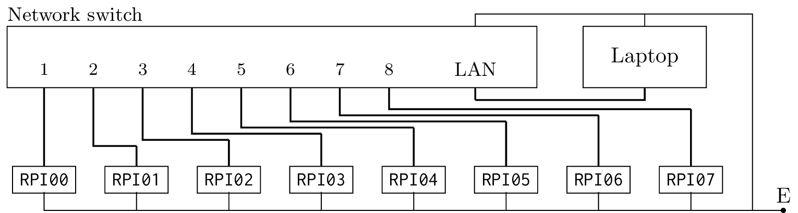

+++
title = 'Raspberry Pi computing cluster, Part 1'
date  = 2025-10-10T09:58:29+03:00
+++

There are multiple ways to create a [local area network][01] (LAN)
for [Raspberry Pi][00] [computing cluster][02] (RPCC). One of them
is to assign a static [IP address][03] to each of Raspberry Pi
computing unit in the RPCC and then use the RPCC's computing units
via these addresses through the Linux terminal. Here are the steps.

<!--more-->

First, one needs to have a [network switch][04] that functions as a
network bus for managing data traffic within the cluster. After
the switch is available, all of the Raspberry Pi computing units
can be connected to it using appropriate [Ethernet cable][05]. One
end of the cable to the Ethernet port of the Pis and one end to
appropriate port of the switch.

[00]:https://en.wikipedia.org/wiki/Raspberry_Pi
[01]:https://en.wikipedia.org/wiki/Local_area_network
[02]:https://en.wikipedia.org/wiki/Computer_cluster
[03]:https://en.wikipedia.org/wiki/IP_address
[04]:https://en.wikipedia.org/wiki/Network_switch
[05]:https://en.wikipedia.org/wiki/Ethernet_physical_layer

The cluster doesn't need electricity yet, but the electricity
connections can be made ready by connecting the [micro-USB][06]
ports of the Pis to extension cord with multiple sockets. After
this, the RPCC is pretty much setup hardware-wise and the setup
should be like in the following diagram, where
$\text{\texttt{RPI0}$N$}$ is hostname for $N$th computing unit,
thick lines are Ethernet cable connections and
&ldquo;$\text{E}$&rdquo; is connection to the electric grid:

<div align = "center">
    
    <br>
    <caption>Figure 1: RPCC Hardware setup</caption>
</div>

[06]:https://en.wikipedia.org/wiki/USB_hardware#Micro_connectors
[07]:https://hardwaremuseum.org/raspberry-pi-computers/raspberry-pi-1-model-b/

[07b]:https://www.howtogeek.com/660841/what-is-a-headless-server/
[08]:https://www.raspberrypi.com/software/operating-systems/
[09]:https://en.wikipedia.org/wiki/SD_card#Micro
[10]:https://github.com/raspberrypi/rpi-imager

Now the operating systems of the computing units can be configured.
The RPCC under development uses eight units of [Raspberry Pi 1
Model B+][07] as the computing units, so this means eight
repetitions of flashing the [headless][07b] [Raspberry Pi OS
(32-bit)][08] to eight $16$ Gb [MicroSD cards][09] with the
[Raspberry Pi Imager][10]. At the Imager's user interface only
computing unit's hostname, user name and user password needs to be
configured. Simple naming scheme to go along with appropriate IP
addresses are:

```
    Unit    Username    Passwd    Hostname    IP address
    1       admin       admin     RPI00       192.168.1.100
    2       admin       admin     RPI01       192.168.1.101
    3       admin       admin     RPI02       192.168.1.102
    4       admin       admin     RPI03       192.168.1.103
    5       admin       admin     RPI04       192.168.1.104
    6       admin       admin     RPI05       192.168.1.105
    7       admin       admin     RPI06       192.168.1.106
    8       admin       admin     RPI07       192.168.1.107
```

The freshly Raspberry Pi OS flashed MicroSD cards are now ready to
be inserted into each MicroSD card slot at opposite side and just
under the Pis' USB and Ethernet ports of the Pis motherboard.
Electricity can be turned on now.

[12]:https://www.raspberrypi.com/documentation/computers/configuration.html
[13]:https://wiki.archlinux.org/title/NetworkManager

After connecting `RPI00` to screen via HDMI allows for doing
necessary configurations for the computing unit's command line
after the the computing unit has booted up. This includes
[expanding the computing unit's file system][12], other possible
configurations, if needed, and setting up the connection using the
[NetworkManager][13].

Example command for doing this is

```
    nmcli con add type ethernet       \
        ifname       eth0             \
        con-name     Ethernet-RPI00   \
        ipv4.method  manual           \
        ipv4.address 192.168.1.100/24 \
        ipv4.gateway 192.168.1.1
```

Interface name (`ifname`) of `RPI00` is found out by running the
command at the unit's terminal:

```
    nmcli show dev
```

and reading the value of `GENERAL.DEVICE`, which was the `eth0`.

One can use the above `nmcli con add` command for configuring the
computing units from `RPI01` to `RPI07`, modifying the
`ipv4.address`' value according the naming scheme described above.

Finally the laptop can be connected to the RPCC using the variation
of the above command:

```
    nmcli con add type ethernet      \
        ifname       [NET-DEV-NAME]  \
        con-name     Ethernet-RPCC   \
        ipv4.method  manual          \
        ipv4.address 192.168.1.99/24 \
        ipv4.gateway 192.168.1.1
```

where the `[NET-DEV-NAME]` is the name of laptop's network device.
Since my laptop does not have Ethernet port, I used USB-to-Ethernet
dongle to add a Ethernet &ldquo;card&rdquo; to my laptop, figured
out the dongles name with the `nmcli show dev` command and replaced
the `[NET-DEV-NAME]` with a proper value.

To check that the laptop can connect to any device in the cluster,
one can open a [SSH-connection][13] to `RPI00` by typing the
command

[13]:.https://www.digitalocean.com/community/tutorials/how-to-use-ssh-to-connect-to-a-remote-server

```
    ssh admin@198.168.1.100
```

to laptop's terminal. `RPI00` replies to the command by sending a
prompt for password. After typing in the password `admin` one is
logged into `RPI00` and the RPCC network configuration is
sufficiently done for now.
