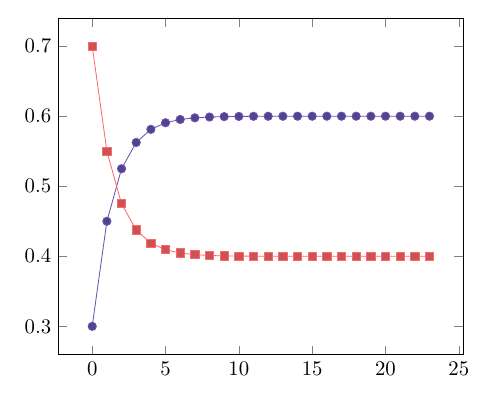

+++
title = 'Simple Markov chain'
date  = 2024-12-03T14:21:30+02:00
+++

A exercise in a book called [*Introduction to linear algebra*][1] by Strang
(2016) first defines a matrix of coefficients ($\mathbf{A}$), a vector of
starting values ($\mathbf{u}_1$) and then asks for computing successive
values $\mathbf{Au}_1 = \mathbf{u}_2$, $\mathbf{Au}_2 = \mathbf{u}_3$,
$\mathbf{Au}_3 = \mathbf{u}_4$, and to explore if any interesting
properties appear. Also, the exercise asks for a program that does the
computation in some programming language, so let's see how to do this in
C++.

[1]: https://math.mit.edu/~gs/linearalgebra/ila5/indexila5.html

<!--more-->

Firstly, the defined matrix of coefficients and first input vector in the
exercise are defined as

$$
    \phantom{,} \
        \mathbf{A} = \begin{bmatrix}
            0.8 & 0.3 \\
            0.2 & 0.7
        \end{bmatrix}
        %
        \ , \quad
        %
        \mathbf{u}_1 = \begin{bmatrix}
            1 \\ 0
        \end{bmatrix}
    \ ,
$$

respectively.

Now to write the program, one needs to decide how to represent matrices in
C++. One to do this is to use the well known [**Eigen**][2] library, that
has a simple syntax for doing the computing in discussion. There's of
course many ways for making use of the Eigen library, but since it's
[available][3] in the Arch Linux repository, I just ended up installing it
from there.

[2]: https://eigen.tuxfamily.org/index.php?title=Main_Page 
[3]: https://archlinux.org/packages/extra/any/eigen/

The syntax for defining a matrix in Eigen differs from that used in
[MATLAB][4]/[Octave][5], for example, but is still straightforward. To
initialize $\mathbf{A}$ and $\mathbf{u}_1$, first a `Eigen::MatrixXd`,
which is defined in the `<Eigen/Dense>` header of Eigen, can be
instantiated by writing

[4]: https://www.mathworks.com/products/matlab.html
[5]: https://octave.org/

```c++
Eigen::MatrixXd A(2,2);
```

and

```c++
Eigen::MatrixXd u(2,1); // Initial of u which is the same as u_1
```

Then the coefficients of $\mathbf{A}$ and $\mathbf{u}_1$ can be set by
typing

```c++
A << 0.8, 0.3,
     0.2, 0.7;
```

and

```c++
u << 0.0, 1.0;
```

After this, solving the iterations $\mathbf{Au}_1 = \mathbf{u}_2$,
$\mathbf{Au}_2 = \mathbf{u}_3$, and so forth, is just a simple matter of
using a `for`-loop as follows,

```c++ {class = listing}
for (int i = 0; i < 100; i++) {
    u = A * u; // The "A * u" call is equal to "Au_{i-1}"
    std::cout << u(0) << ',' << u(1) << '\n';
}
```

say, where iterations are continued up to the total of $100$ times, for
example. The call to `std::cout` at line `2` is in place so that the output
can be saved to a CSV-file.

Using the [gcc][8] along with [`pkg-config`][7] for compiling the program
with the Eigen library can be made by writing the command

[7]: https://gcc.gnu.org/
[8]: https://www.freedesktop.org/wiki/Software/pkg-config/

```bash
$ g++ $(pkg-config --cflags eigen3) markovchain.cpp -o markovchain
```

to the terminal. Then running the executable as a command

```bash
$ ./markovchain | head -n 10
```

in order to get the first ten values, the output is

```bash
0.3,0.7           # u_2
0.45,0.55         # u_3
0.525,0.475       # u_4
0.5625,0.4375     # u_5
0.58125,0.41875   # u_6
0.590625,0.409375 # u_7
0.595312,0.404687 # u_8
0.597656,0.402344 # u_9
0.598828,0.401172 # u_10
0.599414,0.400586 # u_11
```

The original output does not have the comments.

By observing the first decimals it is possible to see that there's a rapid
convergence to values $0.5\ldots$ and $0.4\ldots$ in the output.

Piping the full output of the `./markovchain` to a file and inspecting the
file, it can be seen that with the above decimal precision the output of
the program converges to `(0.6,04)` at $\mathbf{u}_{22}$ even though at the
first iteration, i.e. at $\mathbf{u}_2 = [ \ u_{1_2} \ \ u_{2_2} \ ]^\top$,
$u_{1_2} < u_{2_2} \ $.

This can be seen by plotting the values from $\mathbf{u}_2$ to
$\mathbf{u}_{25}$ by letting $x$-axis represent the number of iteration and
$y$-axis the value of both components at a given iteration:

<div align = "center">
    
    <br>
    <caption>Plots for $u_i$ (red) and $u_2$ (violet)</caption>
</div>

### Source code listings

<details><summary>Program used for computing the Markov chain</summary>

```c++ {class = listing}
#include <iostream>
#include <Eigen/Dense>

int main(int argc, char ** argv) {
    Eigen::MatrixXd A(2,2), u(2,1);

    A << 0.8, 0.3,
         0.2, 0.7;
    u << 0.0, 1.0;

    std::cout << "x,y" << '\n';

    for (int i = 0; i < 100; i++) {
        u = A * u;
        std::cout << u(0) << ',' << u(1) << '\n';
    }

    return 0;
}
```

</details>

### References

Strang, G. (2016). *Introduction to linear algebra* (5th ed.).
Wellesley-Cambridge Press.
